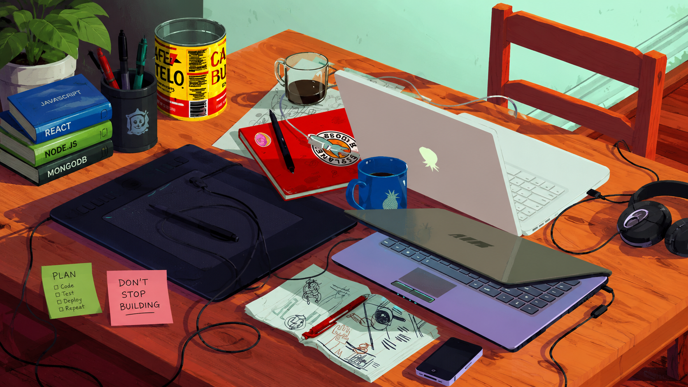

  

# 💫 About Me

- 🔭 I'm currently working on **HackJudge** – an AI-powered hackathon judge that helps participants practice project pitching, answer technical questions, receive intelligent feedback, and build presentation confidence.
  
- 👯 I’m looking to collaborate on **Full Stack Development, Open Source Projects.** 
- 🌱 I’m currently learning **DSA, System Design, Generative AI.** 
- 💬 Ask me about **Java, Web Development.** 
- ⚡ Fun fact: When I'm not coding, you'll probably find me playing PC games.  

## 🌐 Socials:
   

# 💻 Tech Stack:
                   
# 📊 GitHub Stats:
 
 

### ✍️ Random Dev Quote

<!-- Proudly created with GPRM ( https://gprm.itsvg.in ) -->

<!-- Proudly created with GPRM ( https://gprm.itsvg.in ) -->
